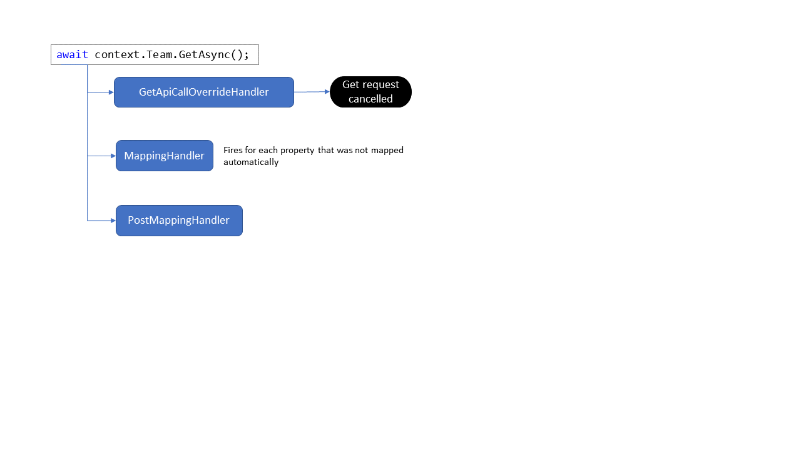

# Event handlers

When you add/extend the model you'll have an option to use event handlers to help. In this article the available event handlers will listed and each one will be explained via a sample.

## Event handler overview

Event handler | Delegate | Description
--------------|----------|------------
`AddApiCallHandler` | `ApiCall AddApiCall();` | When you want to implement **Add** on a model class you need to use this event handler
`GetApiCallOverrideHandler` | `ApiCallRequest GetApiCallOverride(ApiCallRequest input);` | You can use this handler to override or cancel the **get** API call that was created based upon the model decoration
`UpdateApiCallOverrideHandler` | `ApiCallRequest UpdateApiCallOverride(ApiCallRequest input);` | You can use this handler to override or cancel the **update** API call that was created based upon the model decoration
`DeleteApiCallOverrideHandler` | `ApiCallRequest DeleteApiCallOverride(ApiCallRequest input);` | You can use this handler to override or cancel the **delete** API call that was created based upon the model decoration
`MappingHandler` | `TResult Func<in T, out TResult>(T arg);` | Use this handler to customize how the JSON received from the server is mapped to the model. Typically used to handle enumerations and special fields
`PostMappingHandler` | `void Action<in T>(T obj);` | This handler is fired after the complete JSON to model mapping was done and allows you to perform extra logic using the JSON snippet received from the server
`ValidateUpdateHandler` | `void ValidateUpdate(ref FieldUpdateRequest fieldUpdateRequest);` | If you want to perform checks before you allow a property in the model to be updated, then use this event handler

## Event handlers in the model lifecycle

Event handlers fire in a certain order when triggered by an action on the model. In below example the Team is loaded which requires a get request, as such the `GetApiCallOverrideHandler` fires. Unless the get request is cancelled in the event handler the server is queried and JSON results are returned. During mapping of the JSON results to the model the `MappingHandler` is fired for each property for which there's no default mapping. Finally the full JSON to model mapping is done and the `PostMappingHandler` fires allowing you to perform extra processing if needed.



### AddApiCallHandler

This handler is required when you want to implement **Add** functionality on a model class. In the handler you use the properties of the model class instance to be added (`DisplayName` and `Description`) to construct the JSON payload, which you then wrap into the respective Microsoft Graph or SharePoint REST API call.

```csharp
internal partial class TeamChannel
{
    private const string baseUri = "teams/{Parent.GraphId}/channels";

    internal TeamChannel()
    {
        // Handler to construct the Add request for this channel
        AddApiCallHandler = () =>
        {
            // Define the JSON body of the update request based on the actual changes
            dynamic body = new ExpandoObject();
            body.displayName = DisplayName;
            if (!string.IsNullOrEmpty(Description))
            {
                body.description = Description;
            }

            // Serialize object to json
            var bodyContent = JsonSerializer.Serialize(body, typeof(ExpandoObject), new JsonSerializerOptions { WriteIndented = false });

            return new ApiCall(ParseApiRequest(baseUri), ApiType.Graph, bodyContent);
        };
    }
}
```

### GetApiCallOverrideHandler

This event handler is meant to be a last resort, it can override/cancel the generated get query. Typically one should not have to do this, but the option is available for special cases like shown in below example where the system prevents getting the Team if the connected SharePoint site collection is not group connected (as it never can have a Team in that case).

```csharp
internal partial class Team
{
    internal Team()
    {
        GetApiCallOverrideHandler = (ApiCallRequest api) =>
        {
            if (!PnPContext.Site.IsPropertyAvailable(p => p.GroupId) || PnPContext.Site.GroupId == Guid.Empty)
            {
                api.CancelRequest("There is no Office 365 group attached to the current site");
            }

            return api;
        };

    }
}
```

### UpdateApiCallOverrideHandler and DeleteApiCallOverrideHandler

Manipulating updates and deletes is a more common scenario, especially preventing updates/deletes from happening. In below example you see how sending and update or delete request to the server for the General channel of a Team is prevented.

```csharp
internal partial class TeamChannel
{
    internal TeamChannel()
    {
        UpdateApiCallOverrideHandler = (ApiCallRequest apiCallRequest) =>
        {
            if (DisplayName == "General")
            {
                apiCallRequest.CancelRequest("Updating the general channel is not allowed.");
            }

            return apiCallRequest;
        };

        DeleteApiCallOverrideHandler = (ApiCallRequest apiCallRequest) =>
        {
            if (DisplayName == "General")
            {
                apiCallRequest.CancelRequest("Deleting the general channel is not allowed.");
            }

            return apiCallRequest;
        };
    }
}
```

### MappingHandler

The MappingHandler is the most commonly used event handler, you'll see a lot of the model and complex type classes implement this handler. The core purpose of this handler is to handle the JSON to model mapping in cases where this is not done automatically. Also note that when you set the `UseCustomMapping` property of the `GraphFieldMapping` or `SharePointFieldMapping` attributes to true, this handler will also be called for those properties. By default the handler will only be called when there's no automatic JSON to model mapping available, for example in the case of enumerations.

```csharp
internal partial class TeamChannel
{
    internal TeamChannel()
    {
        MappingHandler = (FromJson input) =>
        {
            switch (input.TargetType.Name)
            {
                case "TeamChannelMembershipType": return ToEnum<TeamChannelMembershipType>(input.JsonElement);
            }

            input.Log.LogDebug($"Field {input.FieldName} could not be mapped when converting from JSON");

            return null;
        };
    }
}
```

### PostMappingHandler

This handler will fire after the received JSON has been fully processed...you get the processed JSON as a string for additional needs.

```csharp
internal Web()
{
    PostMappingHandler = (string json) =>
    {
        // implement post mapping handler in case you want to do extra data loading/mapping work
    };
}
```

### ValidateUpdateHandler

Validating properties being updated is common use case: sometimes you want to prevent certain model properties from being updated or you want to "rewrite" the updated value. In below example updating model properties for the General Team channel is prevented.

```csharp
internal partial class TeamChannel
{
    internal TeamChannel()
    {
        // Validation handler to prevent updating the general channel
        ValidateUpdateHandler = (ref PropertyUpdateRequest propertyUpdateRequest) =>
        {
            // Prevent setting all values on the general channel
            if (DisplayName == "General")
            {
                propertyUpdateRequest.CancelUpdate("Updating the general channel is not allowed.");
            }
        };
    }
}
```
