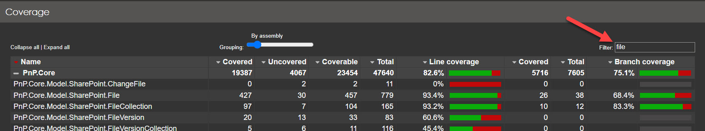
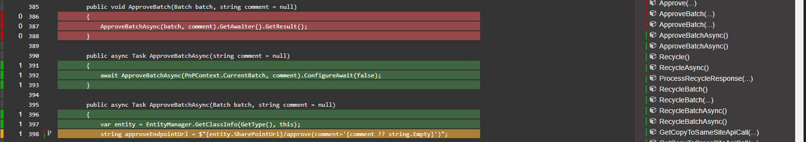

# Writing test cases

Test cases are a crucial part of the PnP Core SDK as they help ensuring code quality and provide feedback to contributors on how well their changes are working. All new contributions **must** be covered by test cases unless the added functionality is already somehow covered by existing test cases.

## Setting up your environment to run the tests cases

If you want to use and extend these unit tests then you'll need to do a simple onetime setup:

1. Go to the test project folder (src\sdk\PnP.Core.Test)
2. Copy `appsettings.copyme.json` to `appsettings.xxx.json` (xxx identifies your test environment) and update the url's and accounts to match with what's available in your tenant. The test system requires that you have setup the following sites (optionally use `setuptestenv.ps1` to help create the needed sites):

   1. A modern, group connected, team site (recommended name is **pnpcoresdktestgroup**) which was **teamified** and which **has a sub site** (recommended name is **subsite**)
   2. A modern communication site (recommended name is **pnpcoresdktest**) which **has a sub site** (recommended name is **subsite**)

3. Copy env.sample to env.txt
4. Open env.txt and put as content the value **xxx** (xxx identifies your test environment)
5. Ensure that you have the **PnP O365 Management Shell** multi-tenant app registered in Azure AD and Consented - this is used for the Graph and SharePoint tests. Quickest way to set this up, is to either:
    * Use PnP PowerShell to [configure the **PnP Management Shell** application](https://pnp.github.io/powershell/articles/authentication.html#setting-up-access) as mentioned
    * Refer to the User documentation article [Using the multi-tenant PnP Azure AD application](../using-the-sdk/configuring%20authentication.md)
6. If you want run the taxonomy tests live you need to configure your term store:
    * Ensure your account is a term store administrator. Go to your SharePoint admin center (e.g. https://contoso-admin.sharepoint.com), under **Content services** select **Term store** and add your account as admin
    * Ensure you've added Dutch as working language for your term store. Go to your SharePoint admin center (e.g. https://contoso-admin.sharepoint.com), under **Content services** select **Term store** and ensure Dutch is in the list of working languages
7. That should be it. Happy testing!

## Running the existing tests in offline mode

The test model runs tests by default in an offline modus. This means that tests run really quick and that they should always work, even if you are offline (not connected to the Internet network). There are just few tests that forcibly require to be executed online, and those will fail when you are offline. After you've setup your environment for testing you should open the Visual Studio Test Explorer and click on the **Run all tests** button to verify that all tests run successfully on your computer.


## Authoring new test cases

### Where do I put my test case?

All test cases belong to the PnP.Core.Test project and generally speaking the test cases will either be linked to extending the model or linked to the "core" part that handles the interaction with SharePoint or Microsoft Graph. For model related test cases, please add them to existing test classes in the respective model folders:

- SharePoint model tests go into the **SharePoint** folder. You either create a new file with test cases or add your test into an existing file.
- Teams model tests go into the **Teams** folder. You either create a new file with test cases or add your test into an existing file.
- Azure Active Directory model tests go into the **AzureActiveDirectory** folder. You either create a new file with test cases or add your test into an existing file

If your test extends an already tested model then most likely you'll be able to add your test to one of the existing test classes.

When you add "core" tests these will need to be added in the **Base** folder for core tests or in the **QueryModel** folder for linq tests.

### Anatomy of a typical test file and test case

It's easier to learn this by looking at a sample:

```csharp
[TestClass]
public class GetTests
{
    [ClassInitialize]
    public static void TestFixtureSetup(TestContext context)
    {
        // Configure mocking default for all tests in this class, unless override by a specific test
        //TestCommon.Instance.Mocking = false;
    }

    #region Tests that use REST to hit SharePoint

    [TestMethod]
    public async Task GetSinglePropertyViaRest()
    {
        //TestCommon.Instance.Mocking = false;
        using (var context = await TestCommon.Instance.GetContextAsync(TestCommon.TestSite))
        {
            var web = await context.Web.GetAsync(p => p.WelcomePage);

            // Is the property populated
            Assert.IsTrue(web.IsPropertyAvailable(p => p.WelcomePage));
            Assert.IsTrue(!string.IsNullOrEmpty(web.WelcomePage));

            // Are other properties still not available
            Assert.IsFalse(web.IsPropertyAvailable(p => p.Title));
        }
    }
}
```

All test classes will have a `TestFixtureSetup` static method which is marked as class initializer. Using this method you can turn all tests in a given class from offline testing to online testing (so testing without using the mock data). Looking at the test method itself you'll notice that:

- To create a `PnPContext` the test cases uses the `TestCommon.Instance.GetContext` method: it's important to use this method as this one is hooked up to the configuration you specified plus it will deliver a context that understands how to work with mock data.
- Uncommenting the `TestCommon.Instance.Mocking = false;` line can be used to put this specific test in online mode: when you start developing your test you'll have do that (as you initially don't have mock data)

### Mocking of server responses in tests

The PnP Core SDK tests use a custom built mocking system which essentially simply saves server responses when running in online mode. When running in offline mode (so when mocking data) the saved server responses are used to mock the server response. All of this works automatically and can be turned on/off by setting the `TestCommon.Instance.Mocking` property to `true` or `false` (see also the FAQ at the end of this page to learn more). When running in online mode each response for a server request will be stored as a file in a sub folder of the current test class. This folder is always named `MockData` and has a sub folder per test class, which ensures that mocking files for a given test can be easily identified. The filename uses the following pattern `{testname}-{context order}-{sequence}.response`.

### Steps to create a test case

If you follow below steps you'll be creating test cases according to the PnP Core SDK guidelines:

1. Find the right location to add your test, either use an existing file or create a new test file
2. Add below test to get started

```csharp
    [TestMethod]
    public async Task NameOfYourTestMethod()
    {
        TestCommon.Instance.Mocking = false;
        using (var context = await TestCommon.Instance.GetContextAsync(TestCommon.TestSite))
        {
            // here comes your actual test code

            using (var context1 = await TestCommon.Instance.GetContextAsync(TestCommon.TestSite, 1))
            {
                // here comes your actual test code, eg code that validates what was created in the first part
            }

        }
    }
```

3. Write your test with mocking turned off
4. Once your test is ready delete the generated mock data files (see the `.response` files in the `MockData` folder) and run your test once more to regenerate them. This step ensures that no stale mocking files will be checked in.
5. Turn mocking on (commenting the `TestCommon.Instance.Mocking = false;` line) and verify your test still works
6. Check in your test case **together with** the offline files generated in the **mockdata** folder
7. **Optionally**: if your test is creating artifacts in Microsoft 365 it's best to code the cleanup in the test or in the default `cleantestenv.copyme.ps1` script

> [!Important]
> - Each checked in test must be checked in with mocking turned on and as such with the appropriate offline test files (the `.response` files). This is important as it ensures that test cases execute really fast and that tests can be used in build/deploy pipelines.
> - When you use `GetContextAsync` multiple times in a single test case then use a sequence number for all but the first usage. The second usage would be like this: `await TestCommon.Instance.GetContextAsync(TestCommon.TestSite, 1)`, the third usage `await TestCommon.Instance.GetContextAsync(TestCommon.TestSite, 2)`.

### Analyze Code Coverage

PnP Core SDK is built with quality in mind, thus among other things, we maintain good code coverage > 80%. Ideally, all new code you add to the library should be covered with tests at not less than 80%. If you want to see, which lines are covered and which are not, you can use one of the methods below.

#### If you have Visual Studio Ultimate

In this case, seeing the coverage is as easy as opening Test Explorer and right-clicking on the desired test and selecting *"Analyze Code Coverage"*:


Visual Studio will run the tests and will highlight all the covered and uncovered lines in your source code.

#### If you do **not** have Visual Studio Ultimate

In case if you use any other Visual Studio editions or use VSCode, you can see the coverage by running a PowerShell script. The script is cross-platform, so you can use it on any OS.

1. Install the prerequisites. The script uses a special [ReportGenerator](https://github.com/danielpalme/ReportGenerator) tool to convert code coverage reports into the human-readable format. You should install it globally first:

   ```bash
   dotnet tool install -g dotnet-reportgenerator-globaltool
   ```

   You may need to restart all your shells so that `reportgenerator` becomes globally available in PowerShell.

2. Navigate to `src\tools\CodeCoverage\` and run `.\Analyze-Code-Coverage.ps1`. You should provide either `-TestProjectName` or `-FqdnClassName` parameters.  
   For example below command will run all tests in the specified class and will launch a browser with the coverage report:

   ```powershell
   .\Analyze-Code-Coverage.ps1 -FqdnClassName PnP.Core.Test.SharePoint.FilesTests
   ```

   Or run all tests in the specified test project and do **not** open a browser with the coverage report:

   ```powershell
   .\Analyze-Code-Coverage.ps1 -TestProjectName PnP.Core.Test -OpenReport $false
   ```

   If you use `-OpenReport $false`, you can just refresh the page in a browser to see the updated results.

3. Analyze the report. By default, it shows you all the files. You should narrow down the results to find the file(s) you're interested in by applying a filter at the top right input  above the files list:

   

   Then you can click on each individual file to see the actual line coverage:

   

## Frequently Asked Questions

### Do I need to recreate the sites after each live test run?

You can opt to recreate the sites each time, but that will be time consuming. It's better to clean the created artifacts before launching a new live test run. The artifacts to clean obviously depend on the written test cases and it's a best practice to keep the `cleantestenv.copyme.ps1` script up to date with the needed cleaning work. You can tailor this script for your environment and save it as `cleantestenv.xxx.ps1` (xxx identifies your test environment) to add your specific cleanup instructions.
In addition, we strongly recommend you to prefix the name of any asset or artifact created in the tests with the constant `TestCommon.PnPCoreSDKTestPrefix`. This will help identifying the assets and ease up the cleaning process. Alternatively, you can use the helper method `TestCommon.GetPnPSdkTestAssetName(string name)` to ensure any name you choose is always prefixed following our convention.

### How can I configure tests to run live versus the default offline run?

By default all the tests run based upon offline data, this is done to enable fast test execution without being dependent on a Microsoft 365 backend to be available and configured for testing. If you however are adding new test cases or refactoring code you might want to run one or more tests in live mode. There are 3 options:

#### Run a single test live

To run a single test live you simply need to uncomment the `TestCommon.Instance.Mocking = false;` line to configure the test to run without using the mocking data, so run live.

```csharp
[TestMethod]
public async Task GetSinglePropertyViaRest()
{
    TestCommon.Instance.Mocking = false;
    using (var context = await TestCommon.Instance.GetContextAsync(TestCommon.TestSite))
    {
        var web = await context.Web.GetAsync(p => p.WelcomePage);

        // Is the property populated
        Assert.IsTrue(web.IsPropertyAvailable(p => p.WelcomePage));
        Assert.IsTrue(!string.IsNullOrEmpty(web.WelcomePage));

        // Are other properties still not available
        Assert.IsFalse(web.IsPropertyAvailable(p => p.Title));
    }
}
```

> [!Note]
> Please only commit tests that can run offline: tests need to have offline data + mocking must be turned on.

#### Run all the tests in a test class live

To run all tests in a given test class live you can turn off mocking via a test class initialized:

```csharp
[ClassInitialize]
public static void TestFixtureSetup(TestContext context)
{
    // Configure mocking default for all tests in this class, unless override by a specific test
    TestCommon.Instance.Mocking = false;
}
```

> [!Note]
> Please only commit tests that can run offline: tests need to have offline data + mocking must be turned on.

#### Run all the tests live

In the rare case you want to run all the test cases live you need to change the default setting of the `Mocking` property from true to false in TestCommon.cs (in the Utilities folder):

```csharp
public bool Mocking { get; set; } = false;
```

> [!Note]
> Please only commit tests that can run offline: tests need to have offline data + mocking must be turned on.

### Can I rename test files or test cases

Yes, if naming needs to change you can do that. Keep in mind that the offline files live in a folder named accordingly to the test file and the offline files depend on the test case name, so you'll have to do similar renames in offline files or folder.

### My test cannot run in offline mode and as such it breaks the GitHub "Build and Test" workflow

If you really can't make your test work offline then you'll need to exclude the test from being executed in the GitHub **Build and Test** workflow. This can be done by adding the following check to your test case:

```csharp
if (TestCommon.RunningInGitHubWorkflow()) Assert.Inconclusive("Skipping live test because we're running inside a GitHub action");
```

### My tests for Terms fail when running in Live Mode

Please add "Dutch" to language support for terms, this is only required for live running for term set tests only, this will take a few minutes before it is effective in the Microsoft Graph.
If this persists, the test uses a Sleep (of 10 seconds) method to "wait" for the removal of test artefacts, sometimes the artefacts are not removed within this time, this will show the test to fail.
