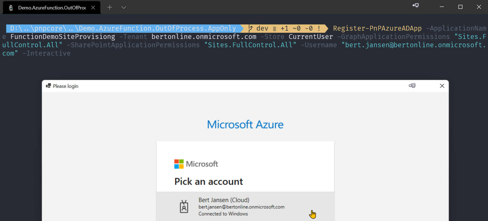
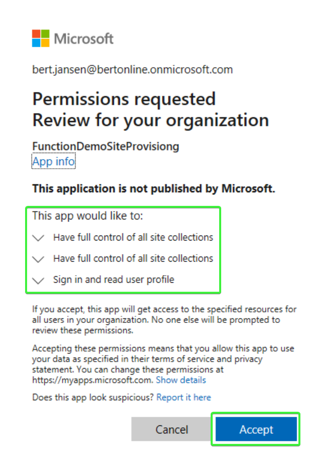
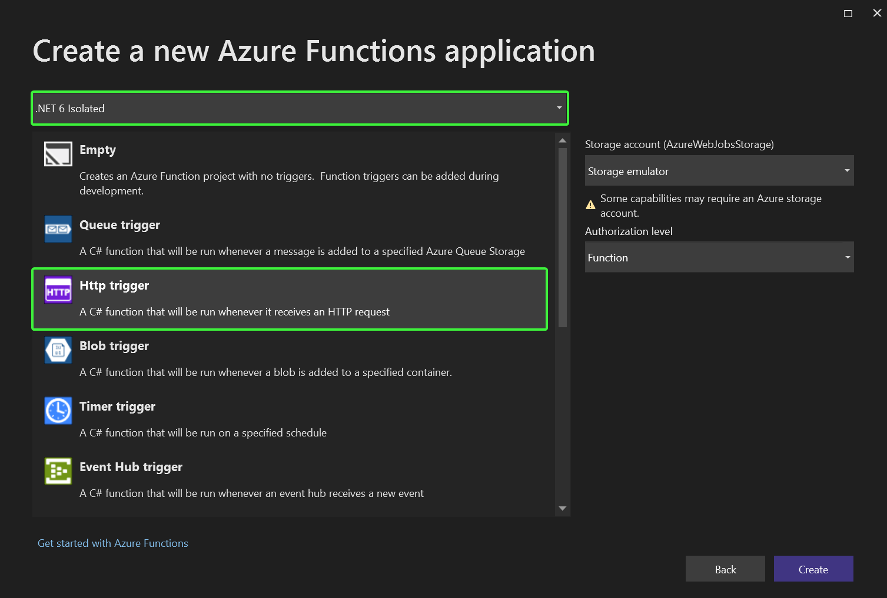
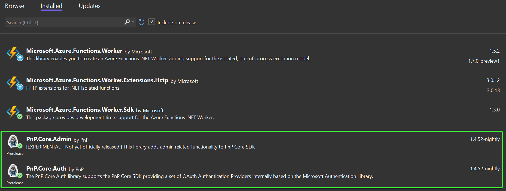
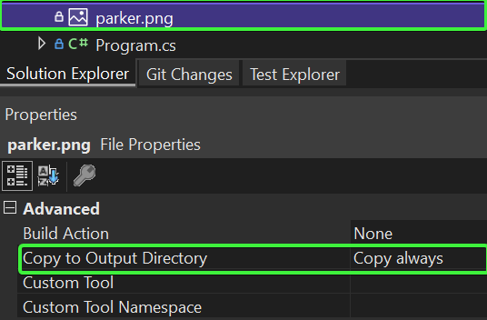
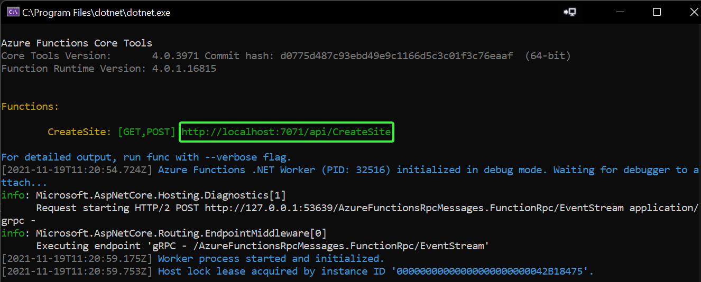
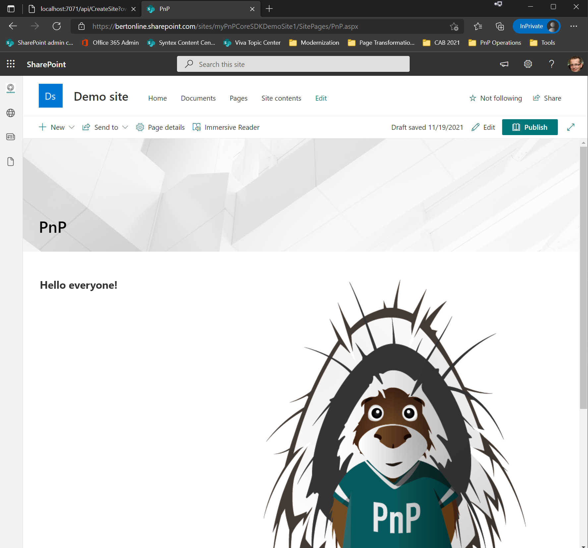

# Build an v4 Azure Function that runs as an isolated process while using application (app-only) permissions

PnP Core SDK works great in Azure functions and this tutorial will walk you through the needed steps to create an [.NET 6.0 Azure V4 function which runs as an isolated process](https://docs.microsoft.com/en-us/azure/azure-functions/create-first-function-vs-code-csharp?tabs=in-process). Process isolation is a feature in Azure Functions that will ensure your function code will not collide with the code already loaded by the Azure Function host process.

## Pre-requisites

Before you start this tutorial your development environment needs to be correctly setup and you do need to have a Microsoft 365 tenant available. If you don't have one, you can get a Microsoft 365 developer subscription when you join the [Microsoft 365 Developer Program](https://developer.microsoft.com/office/dev-program). See the [Microsoft 365 Developer Program documentation](https://docs.microsoft.com/en-us/office/developer-program/office-365-developer-program) for step-by-step instructions about how to join the Microsoft 365 Developer Program and sign up and configure your subscription.

As development environment this tutorial uses Visual Studio 2022, you can either use the free community edition or subscription based professional or enterprise editions. See the [Microsoft Visual Studio site](https://visualstudio.microsoft.com/vs/) to learn more about Visual Studio and how to install and use it.

## Tutorial source code

If you follow this tutorial you end up with a working Azure Function that uses PnP Core SDK. This same tutorial is also available as a [sample containing the source code and brief setup instructions](https://pnp.github.io/pnpcore/demos/Demo.AzureFunction.OutOfProcess.AppOnly/readme.html).

## Create and configure the Azure AD application

### Install PnP PowerShell

To configure the Azure AD application with the needed permissions and configured with a certificate (needed for application permissions) we're using [PnP.PowerShell](https://pnp.github.io/powershell/). If you already have [PnP.PowerShell](https://pnp.github.io/powershell/) installed you can skip this step, if not run below command from a PowerShell prompt:

```PowerShell
Install-Module -Name PnP.PowerShell
```

### Create the Azure AD application

Using PnP PowerShell this becomes really simple. Running cmdlet will create a new Azure AD application, will create a new self-signed certificate and will configure that certificate with the Azure AD application. Finally the right permissions are configured and you're prompted to consent these permissions.

> [!Important]
>
> Approving application permissions requires you to use a user which is Azure AD admin or global admin in your tenant

```powershell
# Ensure you replace contoso.onmicrosoft.com with your Azure AD tenant name
# Ensure you replace joe@contoso.onmicrosoft.com with the user id that's an Azure AD admin (or global admin)

Register-PnPAzureADApp -ApplicationName FunctionDemoSiteProvisiong -Tenant contoso.onmicrosoft.com -Store CurrentUser -GraphApplicationPermissions "Sites.FullControl.All" -SharePointApplicationPermissions "Sites.FullControl.All" -Username "joe@contoso.onmicrosoft.com" -Interactive
```





> [!Important]
> Once this cmdlet is done you do need to to copy **Certificate Thumbprint** and **AzureAppID/ClientId** values from the cmdlet output as these will be needed later in this tutorial.


## Create the Azure Function

### Scaffold a new Azure Function project

Open up Visual Studio 2022 and choose the **Create a new project** option, select **Azure** in the platforms dropdown and then pick **Azure Functions** and click **Next**.


Enter a **Project name** and **Location** and click on **Create**. In the **Create a new Azure Functions application** choose **.NET 6 isolated** in the drop down and then pick **Http trigger** and click on **Create**.



### Add configuration settings and code

Start with adding a new class to the project: right click the project, choose **Add** and then pick **Class...**. Name the class **AzureFunctionSettings.cs** and click on **Add**. Replace the class code with below snippet:

```csharp
public class AzureFunctionSettings
{
    public string SiteUrl { get; set; }
    public string TenantId { get; set; }
    public string ClientId { get; set; }
    public StoreName CertificateStoreName { get; set; }
    public StoreLocation CertificateStoreLocation { get; set; }
    public string CertificateThumbprint { get; set; }
}
```

On top of the class add this using statement:

```csharp
using System.Security.Cryptography.X509Certificates;
```

Open the **local.settings.json** file and replace it's contents with below:

```json
{
  "IsEncrypted": false,
  "Values": {
    "AzureWebJobsStorage": "UseDevelopmentStorage=true",
    "FUNCTIONS_WORKER_RUNTIME": "dotnet-isolated",
    "SiteUrl": "<base site collection url to connect to>",
    "TenantId": "<tenant id>",
    "ClientId": "<application client id>",
    "CertificateThumbPrint": "<thumbprint>",
    "WEBSITE_LOAD_CERTIFICATES": "<thumbprint>"
  },
  "Host": {
    "CORS": "*"
  }
}
```

Next update the configuration file to match your environment:

- Add a SharePoint site url: e.g. https://contoso.sharepoint.com
- Add the ClientId you've captured before
- Fill the `CertificateThumbPrint` and `WEBSITE_LOAD_CERTIFICATES` keys with the ThumbPrint value you've captured before

To get your tenant id you can use below PnP PowerShell cmdlet, just replace contoso with your tenant name. Insert the returned tenant id in the configuration file.

```PowerShell
Get-PnPTenantId -TenantUrl https://contoso.sharepoint.com
```

Your **local.settings.json** file should now be similar to below sample:

```json
{
  "IsEncrypted": false,
  "Values": {
    "AzureWebJobsStorage": "UseDevelopmentStorage=true",
    "FUNCTIONS_WORKER_RUNTIME": "dotnet-isolated",
    "SiteUrl": "https://contoso.sharepoint.com",
    "TenantId": "9bd71689-66cb-4560-bb09-ab908ec21437",
    "ClientId": "8bb62681-cddd-41e0-bfdf-ab908ec8a3c3",
    "CertificateThumbPrint": "1C3342BA9B5269FDBCDCAB5D6334F1A60C73B184",
    "WEBSITE_LOAD_CERTIFICATES": "1C3342BA9B5269FDBCDCAB5D6334F1A60C73B184"
  },
  "Host": {
    "CORS": "*"
  }
}
```

### Add and Configure PnP Core SDK

Right click the project, choose **Manage Nuget Packages...**, ensure **Include prerelease** is checked, click on the **Browse** tab and enter **PnP.Core** in the search box. Select **PnP.Core.Auth** and click on **Install**. A **Preview Changes** dialog appears, click **OK** to continue. In the **License Acceptance** dialog click **I Accept**. Now repeat the same process for the **PnP.Core.Admin** package. Clicking on the **Installed** tab should then show this:



Continue with opening **Program.cs**: this class is executed and function startup and this is the place where we can add and configure the PnP Core SDK services. Replace the contents of the `Main()` method with below code:

```csharp
public static void Main()
{
    AzureFunctionSettings azureFunctionSettings = null;

    var host = new HostBuilder()
        .ConfigureFunctionsWorkerDefaults()
        .ConfigureServices((context, services) =>
        {
            // Add our global configuration instance
            services.AddSingleton(options =>
            {
                var configuration = context.Configuration;
                azureFunctionSettings = new AzureFunctionSettings();
                configuration.Bind(azureFunctionSettings);
                return configuration;
            });

            // Add our configuration class
            services.AddSingleton(options => { return azureFunctionSettings; });

            // Add and configure PnP Core SDK
            services.AddPnPCore(options =>
            {
                // Add the base site url
                options.Sites.Add("Default", new PnPCoreSiteOptions
                {
                    SiteUrl = azureFunctionSettings.SiteUrl
                });
            });

            services.AddPnPCoreAuthentication(options =>
            {
                // Load the certificate to use
                X509Certificate2 cert = LoadCertificate(azureFunctionSettings);

                // Configure certificate based auth
                options.Credentials.Configurations.Add("CertAuth", new PnPCoreAuthenticationCredentialConfigurationOptions
                {
                    ClientId = azureFunctionSettings.ClientId,
                    TenantId = azureFunctionSettings.TenantId,
                    X509Certificate = new PnPCoreAuthenticationX509CertificateOptions
                    {
                        Certificate = LoadCertificate(azureFunctionSettings),
                    }
                });

                // Connect this auth method to the configured site
                options.Sites.Add("Default", new PnPCoreAuthenticationSiteOptions
                {
                    AuthenticationProviderName = "CertAuth",
                });
            });

        })
        .Build();

    host.Run();
}

private static X509Certificate2 LoadCertificate(AzureFunctionSettings azureFunctionSettings)
{
    // Will only be populated correctly when running in the Azure Function host
    string certBase64Encoded = Environment.GetEnvironmentVariable("CertificateFromKeyVault");

    if (!string.IsNullOrEmpty(certBase64Encoded))
    {
        // Azure Function flow
        return new X509Certificate2(Convert.FromBase64String(certBase64Encoded),
                                    "",
                                    X509KeyStorageFlags.Exportable |
                                    X509KeyStorageFlags.MachineKeySet |
                                    X509KeyStorageFlags.EphemeralKeySet);
    }
    else
    {
        // Local flow
        var store = new X509Store(StoreName.My, StoreLocation.CurrentUser);
        store.Open(OpenFlags.ReadOnly | OpenFlags.OpenExistingOnly);
        var certificateCollection = store.Certificates.Find(X509FindType.FindByThumbprint, azureFunctionSettings.CertificateThumbprint, false);
        store.Close();

        return certificateCollection.First();
    }
}
```

Replace the using statements at the top of **Program.cs** with these:

```csharp
using Microsoft.Extensions.Configuration;
using Microsoft.Extensions.DependencyInjection;
using Microsoft.Extensions.Hosting;
using PnP.Core.Auth.Services.Builder.Configuration;
using PnP.Core.Services.Builder.Configuration;
using System;
using System.Linq;
using System.Security.Cryptography.X509Certificates;
```

With above code in place PnP Core SDK is added to the services container of the Azure Function (via `AddPnPCore`). During the add we've configured the site URL to use. Next using `AddPnPCoreAuthentication` authentication is setup to use `X509Certificate` based authentication. The needed certificate is read using the `LoadCertificate` certificate method which supports various certificate load methods. With authentication configured the final step is connect the configured authentication provider with the site we configured earlier on.

For configuring PnP Core SDK we also needed data from the **local.settings.json** configuration file which implemented by creating and populating a `AzureFunctionSettings` class and adding that to the function's services container.

### Using PnP Core SDK in the function

The final step before we can test the Azure Function is adding our actual function code. Start with right clicking on **Function1.cs**, choose **Rename** and name it **CreateSite.cs**. Click **Yes** on the rename ask. Open **CreateSite.cs** and replace the `CreateSite` class with below class

```csharp
public class CreateSite
{
    private readonly ILogger logger;
    private readonly IPnPContextFactory contextFactory;
    private readonly AzureFunctionSettings azureFunctionSettings;

    public CreateSite(IPnPContextFactory pnpContextFactory, ILoggerFactory loggerFactory, AzureFunctionSettings settings)
    {
        logger = loggerFactory.CreateLogger<CreateSite>();
        contextFactory = pnpContextFactory;
        azureFunctionSettings = settings;
    }

    /// <summary>
    /// Demo function that creates a site collection, uploads an image to site assets and creates a page with an image web part
    /// GET/POST url: http://localhost:7071/api/CreateSite?owner=joe@contoso.onmicrosoft.com&sitename=myPnPCoreSDKDemoSite1
    /// </summary>
    /// <param name="req"></param>
    /// <returns></returns>
    [Function("CreateSite")]
    public async Task<HttpResponseData> Run([HttpTrigger(AuthorizationLevel.Function, "get", "post")] HttpRequestData req)
    {
        logger.LogInformation("CreateSite function starting...");

        // Parse the url parameters
        NameValueCollection parameters = HttpUtility.ParseQueryString(req.Url.Query);
        var siteName = parameters["siteName"];
        var owner = parameters["owner"];

        HttpResponseData response = null;

        try
        {
            using (var pnpContext = await contextFactory.CreateAsync("Default"))
            {
                response = req.CreateResponse(HttpStatusCode.OK);
                response.Headers.Add("Content-Type", "application/json");

                var communicationSiteToCreate = new CommunicationSiteOptions(new Uri($"https://{pnpContext.Uri.DnsSafeHost}/sites/{siteName}"), "Demo site")
                {
                    Description = "PnP Core SDK demo site",
                    Language = Language.English,
                    Owner = $"i:0#.f|membership|{owner}"
                };

                logger.LogInformation($"Creating site: {communicationSiteToCreate.Url}");

                // Create the new site collection
                using (var newSiteContext = await pnpContext.GetSiteCollectionManager().CreateSiteCollectionAsync(communicationSiteToCreate))
                {
                    logger.LogInformation($"Site created: {communicationSiteToCreate.Url}");

                    // Step 1: Upload image to site assets library
                    var siteAssetsLibrary = await newSiteContext.Web.Lists.EnsureSiteAssetsLibraryAsync(p => p.RootFolder);
                    var uploadFolder = await siteAssetsLibrary.RootFolder.EnsureFolderAsync("SitePages/PnP");
                    var addedFile = await uploadFolder.Files.AddAsync("parker.png",File.OpenRead($".{Path.DirectorySeparatorChar}parker.png"), true);

                    // Step 2: Create the page
                    var page = await newSiteContext.Web.NewPageAsync();
                    page.AddSection(CanvasSectionTemplate.OneColumn, 1);

                    // Add text with inline image
                    var text = page.NewTextPart();
                    var parker = await page.GetInlineImageAsync(text, addedFile.ServerRelativeUrl, new PageImageOptions { Alignment = PageImageAlignment.Left });
                    text.Text = $"<H2>Hello everyone!</H2>{parker}<P>Community rocks, sharing is caring!</P>";
                    page.AddControl(text, page.Sections[0].Columns[0]);

                    // Save the page
                    await page.SaveAsync("PnP.aspx");

                    // Return the URL of the created site
                    await response.WriteStringAsync(JsonSerializer.Serialize(new { siteUrl = newSiteContext.Uri.AbsoluteUri }));
                }

                return response;
            }
        }
        catch (Exception ex)
        {
            response = req.CreateResponse(HttpStatusCode.OK);
            response.Headers.Add("Content-Type", "application/json");
            await response.WriteStringAsync(JsonSerializer.Serialize(new { error = ex.Message }));
            return response;
        }
    }
}
```

Replace the namespaces on top of the file with these:

```csharp
using Microsoft.Azure.Functions.Worker;
using Microsoft.Azure.Functions.Worker.Http;
using Microsoft.Extensions.Logging;
using PnP.Core.Admin.Model.SharePoint;
using PnP.Core.Model.SharePoint;
using PnP.Core.Services;
using System;
using System.Collections.Specialized;
using System.IO;
using System.Net;
using System.Text.Json;
using System.Threading.Tasks;
using System.Web;
```

This **CreateSite** Azure Function will do a number of things:

1. It will create a `PnPContext` for the site you've setup in **local.settings.json**
2. It will create a new site collection using the name and owner information passed in via the request
3. It will ensure there is a Site Assets library in the newly created SharePoint site
4. It will ensure there's a folder `SitePages` having a sub folder `PnP` in the Site Assets library
5. It will upload an image named **parker.png** to the `PnP` folder
6. It will create a new page with a one column section and insert text with an inline image

Before we can test the sample we still need to add the **parker.png** image file, you can [grab the original PnP parker from here](https://github.com/pnp/media/blob/master/parker/pnp/600w/parker.png) but you can obviously take any image you have and name if **parker.png**. Important is that you you change the **Copy to Output Directory** to **Copy Always**



## Test the Azure Function

Start with putting a breakpoint on the first line of the **Run** method (line 38) so a breakpoint is hit when the function is invoked. Now press **F5** to start the function, you should see a console window:



To test the function we need to construct a URL first, start with copying the URL the function is running on (`http://localhost:7071/api/CreateSite`) and then add `owner` and `siteName` URL parameters so that you get this:

```text
http://localhost:7071/api/CreateSite?owner=joe@contoso.onmicrosoft.com&sitename=myPnPCoreSDKDemoSite1
```

Ensure you use an owner that exists in your tenant and that the provided site name does not yet exist, in above case a site collection named `https://contoso.sharepoint.com/sites/myPnPCoreSDKDemoSite1` will be created. Now copy the crafted URL and paste it into your browser address bar and hit enter. What will happen is that the function will be invoked and execution will stop at your breakpoint. By pressing **F10** you can walk over the code step by step, press **F5** to just continue execution. Once the execution ended you see the created site collection URL in the output:


Feel free to open the created site collection and navigate the **PnP.aspx** page to see parker :-)



## Deploy the sample to Azure

### Create Azure Function App

Go to the [Azure Portal](https://portal.azure.com/) and create a new Function App (consumption plan) using following settings:

- Publish: **Code**
- Runtime stack: **.NET**
- Version: **6**
- Region: pick the region that works best for you

Click **Review + create**, verify the settings and click **Create**. Now your function is provisioned in Azure.

### Configure the Function App

Once the Function App has been created navigate to **Settings** -> **Configuration** and add the following **Application settings**:

Name | Value
-----|------
SiteUrl | base site collection url to connect to, e.g. https://contoso.sharepoint.com
TenantId | tenant id, e.g. 9bd71689-66cb-4560-bb09-ab908ec21437
ClientId | application client id, e.g. 8bb62681-cddd-41e0-bfdf-ab908ec8a3c3

Click **Save** to persist the changes.

Under **Function runtime settings** verify the Runtime version is set to **~4**.

### Deploying the certificate - use KeyVault

Final configuration step needed is ensuring the Azure Function App can use the configured certificate. Quite often you want to reuse your certificate across multiple Azure resources and then consolidating all secrets and certificates in an Azure KeyVault is a commonly used scenario. So let's explain how to make that happen.

- Ensure the managed identity of the function is on: click on **Settings** -> **Identity** and ensure System assigned status is set to **On**
- Navigate to your Azure KeyVault or create a new one if you've none available
- In KeyVault click on **Settings** -> **Certificates** -> **Generate/Import** -> select **Import** in the dropdown and provide a name and path the PFX file you've created earlier on via the `Register-PnPAzureADApp` Powershell cmdlet. Click **Create** to add the certificate
- In KeyVault click on **Settings** -> **Access Policies** -> **+ Add Access Policy**:
  - Select Secret Permission **Get**
  - Select Certificate Permission **Get**
  - Select principal:
    - Click on **none selected**
    - In the **Principal** page enter the name of the Azure Function App, this selects the managed identity that you've enabled before. Click **Select** to pick that principal
  - Click **Add** to add the new Access Policy
  - Click **Save** to persist the changes

Using above steps you've now uploaded your certificate in a KeyVault and you've enabled your Function App to read secrets from the vault using it's managed identity. Final step is letting the Azure Function App now which certificate to pick. For that follow these steps:

- In KeyVault click on your certificate and then click on the **Current version**. The certificate details will be shown, copy the **Certificate Identifier** e.g. `https://mykeyvault.vault.azure.net/certificates/PnPCoreSDKDemo/6c752ad7218248b0976f387ef288523a`
- In the Function App navigate to **Settings** -> **Configuration** and add the following **Application setting**. Note the certificate version identifier has been dropped from the URL.

Name | Value
-----|------
CertificateFromKeyVault | @Microsoft.KeyVault(SecretUri=https://mykeyvault.vault.azure.net/certificates/PnPCoreSDKDemo/)

Click **Save** to persist the changes.

### Deploying the certificate - local upload to Function App

Previous steps showed you how to manage your certificate via KeyVault, but you can also opt to simply upload the certificate to the Azure Function App.

- Navigate to **Settings** -> **TLS/SSL Settings** and click on **Private Key Certificates (.pfx)**
- Click on **Upload Certificate**, browse to the location of the PFX file you've created earlier on via the `Register-PnPAzureADApp` Powershell cmdlet. Click **Upload** to upload the certificate
- Navigate to **Settings** -> **Configuration** and add the following **Application settings**

Name | Value
-----|------
CertificateThumbPrint | thumbprint, e.g. 1C3342BA9B5269FDBCDCAB5D6334F1A60C73B184
WEBSITE_LOAD_CERTIFICATES | thumbprint, e.g. 1C3342BA9B5269FDBCDCAB5D6334F1A60C73B184

### Deploy the Function App code from Visual Studio

Final step now that the Function App is configured is to deploy our bits.

- Right click the project in Visual Studio and choose **Publish...**
- Chose the **Import Profile** option:
  - Navigate to your Azure Function App in Azure Portal and click on **Get publish profile** from the **Overview** page
  - Select the downloaded profile
- Click on **Publish** to push your project to the Azure Function App

### Test your Function App in Azure

To test your Function App you now need to build an URL that points to your Azure Function App + it's function authorization key. To that URL the `owner` and `siteName` URL parameters have to be added. To get your Azure Function URL follow these steps:

- Navigate to your Azure Function App in Azure Portal and Navigate to **Functions** -> **Functions**
- Click on the **CreateSite** function
- Click on **Get Function Url** and copy the proposed URL
- Append `&owner=joe@contoso.onmicrosoft.com&sitename=azurefunctiondemo001`

The final result will be something along these lines:

`https://myfunctionapphost.azurewebsites.net/api/CreateSite?code=OerO/tVAIGbCacM1e6PYi6MsH5rsHmzpjUmZMlKTYayDhcYMJ9zjZw==&owner=joe@contoso.onmicrosoft.com&sitename=azurefunctiondemo001`
