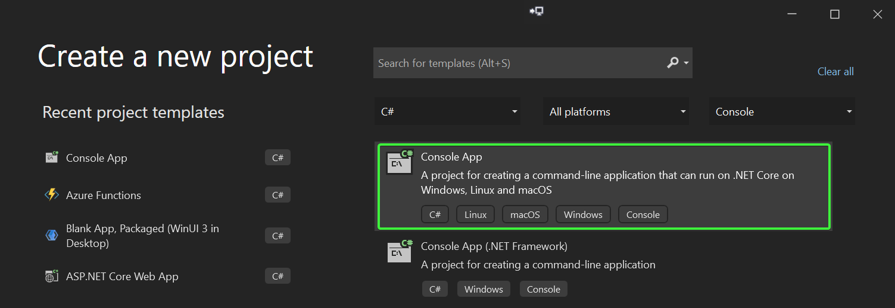
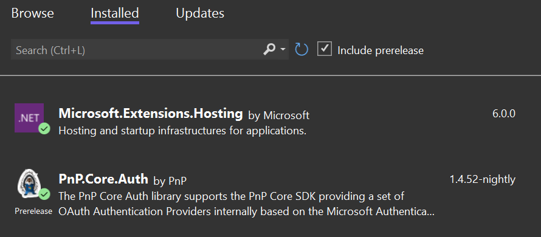

# Minimal PnP Core SDK sample

PnP Core SDK works great in .NET console applications and this tutorial will walk you through the needed steps to create a minimal [.NET 6.0 console application](https://docs.microsoft.com/en-us/dotnet/core/tutorials/with-visual-studio?pivots=dotnet-6-0).

## Pre-requisites

Before you start this tutorial your development environment needs to be correctly setup and you do need to have a Microsoft 365 tenant available. If you don't have one, you can get a Microsoft 365 developer subscription when you join the [Microsoft 365 Developer Program](https://developer.microsoft.com/office/dev-program). See the [Microsoft 365 Developer Program documentation](https://docs.microsoft.com/en-us/office/developer-program/office-365-developer-program) for step-by-step instructions about how to join the Microsoft 365 Developer Program and sign up and configure your subscription.

As development environment this tutorial uses Visual Studio 2022, you can either use the free community edition or subscription based professional or enterprise editions. See the [Microsoft Visual Studio site](https://visualstudio.microsoft.com/vs/) to learn more about Visual Studio and how to install and use it.

## Tutorial source code

If you follow this tutorial you end up with a working console application that uses PnP Core SDK. This same tutorial is also available as a [sample containing the source code and brief setup instructions](https://pnp.github.io/pnpcore/demos/Demo.Console.Minimal/readme.html).

## Create and configure the Azure AD application

PnP Core SDK requires an Azure AD application to authenticate to SharePoint:

1. Navigate to https://aad.portal.azure.com
2. Click on **Azure Active Directory**, followed by navigating to **App registrations**
3. Add a new application via the **New registration** link
4. Give your application a name, e.g. PnPCoreSDKConsoleDemo and add **http://localhost** as redirect URI. Clicking on **Register** will create the application and open it
5. Take note of the **Application (client) ID** value, you'll need it in the next step
6. Click on **API permissions** and add these **delegated** permissions
   1. Microsoft Graph -> Sites.Manage.All
   2. SharePoint -> AllSites.Manage
7. Consent the application permissions by clicking on **Grant admin consent**

## Create the console application

Open up Visual Studio 2022 and choose the **Create a new project** option, select **Console** in the project types dropdown, pick **c#** in the languages dropdown and then choose **Console App** and click **Next**.



Enter a **Project name** and **Location** and click on **Create**. In the **Additional information** dialog choose **.NET 6.0 (Long-term support)** and click on **Create**.

Right click the project, choose **Manage Nuget Packages...**, ensure **Include prerelease** is checked, click on the **Browse** tab and enter **PnP.Core** in the search box. Select **PnP.Core.Auth** and click on **Install**. A **Preview Changes** dialog appears, click **OK** to continue. In the **License Acceptance** dialog click **I Accept**. Now repeat the same process for the **Microsoft.Extensions.Hosting** package. Clicking on the **Installed** tab should then show this:



Now continue with opening **Program.cs** and completely replace the code with below snippet:

```csharp
using Microsoft.Extensions.DependencyInjection;
using Microsoft.Extensions.Hosting;
using PnP.Core.Auth;
using PnP.Core.Services;

string clientId = "c6b15c83-d569-4514-b4af-d433110123de";
string siteUrl = "https://bertonline.sharepoint.com/sites/prov-1";

// Creates and configures the host
var host = Host.CreateDefaultBuilder()
    .ConfigureServices((context, services) => 
    {
        // Add PnP Core SDK
        services.AddPnPCore(options =>
        {
            // Configure the interactive authentication provider as default
            options.DefaultAuthenticationProvider = new InteractiveAuthenticationProvider()
            {
                ClientId = clientId,
                RedirectUri = new Uri("http://localhost")
            };
        });
    })
    .UseConsoleLifetime()
    .Build();

// Start the host
await host.StartAsync();

using (var scope = host.Services.CreateScope())
{
    // Ask an IPnPContextFactory from the host
    var pnpContextFactory = scope.ServiceProvider.GetRequiredService<IPnPContextFactory>();

    // Create a PnPContext
    using (var context = await pnpContextFactory.CreateAsync(new Uri(siteUrl)))
    {
        // Load the Title property of the site's root web
        await context.Web.LoadAsync(p => p.Title);
        Console.WriteLine($"The title of the web is {context.Web.Title}");
    }
}
```

## Configure the console application

Before the console application can be tested there are two variables that have to be set:

- Update `clientId` to match the client id of the Azure AD application you've created previously
- Set `siteUrl` to a site in your tenant

## Test the console application

Press **F5** to launch the application. A new browser window/tab will open asking you to authenticate with your Microsoft 365 account. Once you've done that the application will get the title of the site and display it.


