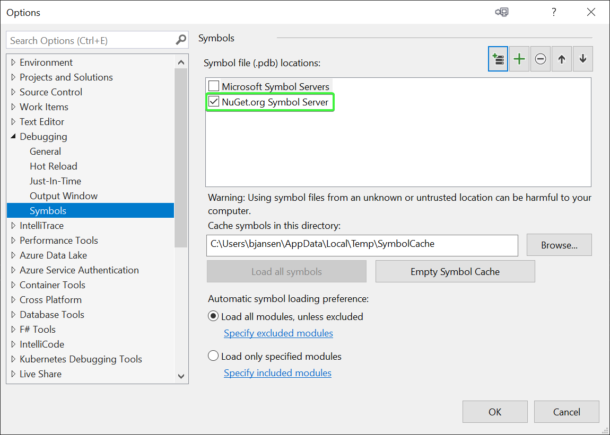

# Debugging PnP Core SDK

The typical way to use the PnP Core SDK is by adding a reference to it via the [PnP Core SDK NuGet package](https://www.nuget.org/packages/PnP.Core/). The common way for folks to debug a library shipped via NuGet is to pull down the source, compile it and then connect your app to your own compiled version. This approach works, but is not ideal as you need to do a lot of work plus things get more complex if you want to debug an older version of the package.

To address the above the PnP Core SDK packages support [Source Link](https://github.com/dotnet/sourcelink), which makes it possible for you to step through the PnP Core SDK without doing any extra downloads or compilations. The only thing needed is a one time Visual Studio configuration and you're good to go.

> [!Important]
> This is a really easy way to understand what the PnP Core SDK does without any extra setup, so highly recommended!

## Configuring Visual Studio to support debugging PnP Core SDK packages via Source Link

By default Visual Studio is not configured to work with [Source Link](https://github.com/dotnet/sourcelink), follow below one-time configuration to make [Source Link](https://github.com/dotnet/sourcelink) work:

Launch Visual Studio and go to `Tools` -> `Options` and select the **General** page in the **Debugging** category. On that page:

- Uncheck the "Enable Just My Code" check box
- Check the "Enable source server support" check box
- Check the "Enable Source Link support"

Select the **Symbols** page in the **Debugging** category. On that page:

- Check the "NuGet.org Symbol Server" option nas possible PDB location

## Using Source Link

Once you've setup [Source Link](https://github.com/dotnet/sourcelink) when you're debugging you can simply press F11 on any PnP Core SDK code construct and Visual Studio will automatically fetch the correct code from GitHub and allow you to step into the code.
