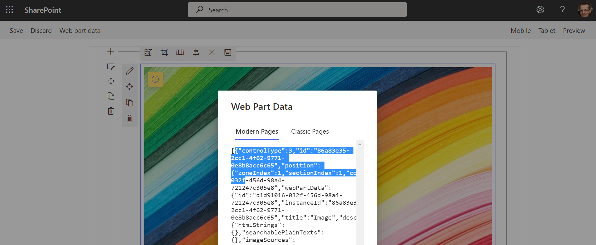

# Working with web parts and text parts

A page is a canvas with a layout (the sections and columns) and on that canvas you can add controls: simple text parts or more complex web parts. This chapter shows how you can create, configure and add a control on a page.

In the remainder of this article you'll see a lot of `context` use: in this case this is a `PnPContext` which was obtained via the `PnPContextFactory` as explained in the [overview article](readme.md) and show below:

```csharp
using (var context = await pnpContextFactory.CreateAsync("SiteToWorkWith"))
{
    // See next chapter on how to use the PnPContext for working with pages
}
```

## Working with text parts

When you need to put (formatted) text on a page you need to create a [text part](https://pnp.github.io/pnpcore/api/PnP.Core.Model.SharePoint.IPageText.html), configure it and add it to a column of a section on the page. Below sample shows how a simple text can be added to a page with a one column section.

```csharp
// Create the page
var page = await context.Web.NewPageAsync();

// adding sections to the page
page.AddSection(CanvasSectionTemplate.OneColumn, 1);

// Adding text control to the first section, first column
page.AddControl(page.NewTextPart("PnP Rocks!"), page.Sections[0].Columns[0]);

// Save the page
await page.SaveAsync("MyPage.aspx");
```

The modern page text part however also supports formatted text, for that you need to "reverse engineer" the needed html syntax. The easiest approach is using simply configuring the formatted text on a page (e.g. named "sample") and then use [PnP PowerShell](https://github.com/pnp/powershell) to read the raw text value.

```PowerShell
Connect-PnPOnline -url https://contoso.sharepoint.com/sites/demo -PnPManagementShell

// show the components on the page
Get-PnPClientSideComponent -Page "sample"

// get a reference to the component you want to inspect
$text = Get-PnPClientSideComponent -Page "sample" -InstanceId 1ae36bd9-1635-447e-a77c-87621e2016c3

// output the text value to the clipboard
$text.Text | clip
```

Below sample shows formatted text being added

```csharp
// Create the page
var page = await context.Web.NewPageAsync();

// adding sections to the page
page.AddSection(CanvasSectionTemplate.OneColumn, 1);

// Adding formatted text control to the first section, first column
page.AddControl(page.NewTextPart("PnP <span class=\"fontSizeXLargePlus\"><span class=\"fontColorRed\"><strong>rocks!</strong></span></span>"), page.Sections[0].Columns[0]);

// Save the page
await page.SaveAsync("MyPage.aspx");
```

### Using inline images in text parts

During fall 2021 inline images were added to SharePoint providing users the option to include images inside the their text parts. To add an inline image to your text you can use the `GetInlineImage` methods to configure an image to be added inline. The method returns a html snippet that you can add add to your text part.

```csharp
// Create the page
var page = await context.Web.NewPageAsync();

// adding sections to the page
page.AddSection(CanvasSectionTemplate.OneColumn, 1);

// Create text part
var textPart = page.NewTextPart();

// Prepare inline image for inserting
var inlineImage = await page.GetInlineImageAsync(textPart, "/sites/prov-2/siteassets/__siteicon__.png", new PageImageOptions() 
{ 
    Alignment = PageImageAlignment.Left,
    Width = 200,
    Height = 200
});

// Insert the inline image in the text part text
textPart.Text = $"<H1>My header</H1>{inlineImage}<p>Text after image</p>";

// Adding text part control to the first section, first column
page.AddControl(textPart, page.Sections[0].Columns[0]);

// Save the page
await page.SaveAsync("MyPage.aspx");
```

> [!Note]
> It's recommended to provide the image size to ensure the image resize handles are correctly showing up when you edit the created page later on.

## Working with web parts

### Generic instructions that apply for all web parts

Adding web parts is quite similar to adding text parts, but the configuration of web parts takes more work. When creating a web part you start from a blueprint of that web part, using the [AvailablePageComponentsAsync method](https://pnp.github.io/pnpcore/api/PnP.Core.Model.SharePoint.IPage.html#PnP_Core_Model_SharePoint_IPage_AvailablePageComponentsAsync_System_String_) you can get a list of all the possible web parts that can be added on a page. If you've installed custom web parts on the site hosting the page then these will show up as well in that list.

> [!Important]
> The [AvailablePageComponentsAsync method](https://pnp.github.io/pnpcore/api/PnP.Core.Model.SharePoint.IPage.html#PnP_Core_Model_SharePoint_IPage_AvailablePageComponentsAsync_System_String_) is a call that takes quite some time and returns a large chunk of data. It's best to do this call only once and use the result while you configure pages in your application.

Below sample shows the basics of adding an out of the box web part on a page. Note that the [DefaultWebPartToWebPartId method](https://pnp.github.io/pnpcore/api/PnP.Core.Model.SharePoint.IPage.html#PnP_Core_Model_SharePoint_IPage_DefaultWebPartToWebPartId_PnP_Core_Model_SharePoint_DefaultWebPart_) is used to translate out of the box web parts to their respective internal web part names (guids).

```csharp
// Create the page
var page = await context.Web.NewPageAsync();

// adding sections to the page
page.AddSection(CanvasSectionTemplate.OneColumn, 1);

// get the web part 'blueprint'
var availableComponents = await page.AvailablePageComponentsAsync();
var imageWebPartComponent = availableComponents.FirstOrDefault(p => p.Id == page.DefaultWebPartToWebPartId(DefaultWebPart.Image));

// add the web part to the first column of the first section
page.AddControl(page.NewWebPart(imageWebPartComponent), page.Sections[0].Columns[0]);

// Save the page
await page.SaveAsync("MyPage.aspx");
```

An alternative approach to above is using the [InstantiateDefaultWebPart](https://pnp.github.io/pnpcore/api/PnP.Core.Model.SharePoint.IPage.html#PnP_Core_Model_SharePoint_IPage_InstantiateDefaultWebPartAsync_PnP_Core_Model_SharePoint_DefaultWebPart_) method which internally handles the available component loading and enum mapping.

> [!Note]
> Each call to [InstantiateDefaultWebPart](https://pnp.github.io/pnpcore/api/PnP.Core.Model.SharePoint.IPage.html#PnP_Core_Model_SharePoint_IPage_InstantiateDefaultWebPartAsync_PnP_Core_Model_SharePoint_DefaultWebPart_) will result in the [AvailablePageComponentsAsync method](https://pnp.github.io/pnpcore/api/PnP.Core.Model.SharePoint.IPage.html#PnP_Core_Model_SharePoint_IPage_AvailablePageComponentsAsync_System_String_) being called, performance wise it's better to use the above approach as that will limit the number of [AvailablePageComponentsAsync](https://pnp.github.io/pnpcore/api/PnP.Core.Model.SharePoint.IPage.html#PnP_Core_Model_SharePoint_IPage_AvailablePageComponentsAsync_System_String_) calls.

```csharp
// Create the page
var page = await context.Web.NewPageAsync();

// adding sections to the page
page.AddSection(CanvasSectionTemplate.OneColumn, 1);

// get the web part 'blueprint'
var imageWebPartToAdd = await page.InstantiateDefaultWebPartAsync(DefaultWebPart.Image);

// add the web part to the first column of the first section
page.AddControl(imageWebPartToAdd, page.Sections[0].Columns[0]);

// Save the page
await page.SaveAsync("MyPage.aspx");
```

Above code adds an unconfigured image web part to the page, but what if you wanted to add a configured web part? The web part configuration is stored in a json blob and configuring the web part on a page and copying the json blob is often the easiest approach. The easiest approach to do this is using the **WorkBench**: take your site url and append `_layouts/15/workbench.aspx` and you'll see an editor opening up. Put the web part you need on the page and configure it. Once that's done click on the **Web part data** button on the toolbar and you should should see this:



Copy the json shown in the **Modern Pages** tab **without the surrounding square brackets**. Once you've the web part configuration json you need to escape the double quotes, simply doing a replace of " with \\" does the trick.

```csharp
// Create the page
var page = await context.Web.NewPageAsync();

// adding sections to the page
page.AddSection(CanvasSectionTemplate.OneColumn, 1);

// get the web part 'blueprint'
var availableComponents = await page.AvailablePageComponentsAsync();
var imageWebPartComponent = availableComponents.FirstOrDefault(p => p.Id == page.DefaultWebPartToWebPartId(DefaultWebPart.Image));

var image = page.NewWebPart(imageWebPartComponent);
image.PropertiesJson = "{\"controlType\":3,\"id\":\"86a83e35-2cc1-4f62-9771-0e8b8acc6c65\",...dropped for clarity...,\"addedFromPersistedData\":true}";

// add the web part to the first column of the first section
page.AddControl(image, page.Sections[0].Columns[0]);

// Save the page
await page.SaveAsync("MyPage.aspx");
```

> [!Note]
> Above approach using the workbench also works good for getting a formatted text snippet.

### Image web part instructions

As image web parts are very commonly used on pages, PnP Core SDK provides enhanced support which makes it easier to add an image web part. This enhanced support comes in the form of the `GetImageWebPart` methods:

```csharp
// Create the page
var page = await context.Web.NewPageAsync();

// adding sections to the page
page.AddSection(CanvasSectionTemplate.OneColumn, 1);

// configure an image web part for a given site relative url
var image = await page.GetImageWebPartAsync("/sites/prov-2/siteassets/__siteicon__.png", new PageImageOptions
{ 
    Alignment = PageImageAlignment.Left,
    Width = 200,
    Height = 200
});

// add the web part to the first column of the first section
page.AddControl(image, page.Sections[0].Columns[0]);

// Save the page
await page.SaveAsync("MyPage.aspx");
```

> [!Note]
> It's recommended to provide the image size to ensure the image resize handles are correctly showing up when you edit the created page later on.
