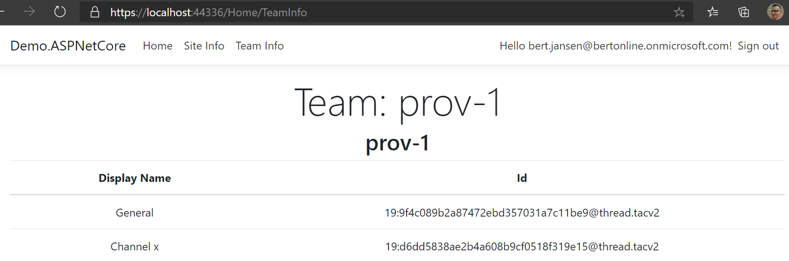

# PnP Core SDK - ASP.NET Core Sample

This solution demonstrates how the PnP Core SDK can be used in a ASP.NET Core web application

## Source code

You can find the sample source code here: [/samples/Demo.ASPNetCore](https://github.com/pnp/pnpcore/tree/dev/samples/Demo.ASPNetCore)

# Run the sample

## Register and configure an AAD app

In order for the user to authenticate on the App, A new app registration should be created on Azure Portal

- Go to [Azure Active Directory Portal](https://aad.portal.azure.com)

- In App registrations, click __New registration__

- Enter a name for your new app, make sure *Accounts in this organizational directory only* is selected. As the Redirect URI, in Web platform enter __https://localhost:44336/signin-oidc__ (The port may vary according to your Visual Studio)

- Under __Implicit grant__ section, check __ID tokens__

- Go to __API permissions__ section , click __Add a permission__
  - Select __Microsoft Graph__ > __Delegated permissions__ > select __Directory.Read.All__
  - Select __Microsoft Graph__ > __Delegated permissions__ > select __User.Read__
  - Select __Microsoft Graph__ > __Delegated permissions__ > select __Sites.Read.All__
  - Select __Microsoft Graph__ > __Delegated permissions__ > select __Files.Read.All__
  - Select __SharePoint__ > __Delegated permissions__ > select __AllSites.Read__
  - Select __Azure Active Directory Graph__ > __Delegated permissions__ > select __Directory.Read.All__
  - Select __Azure Active Directory Graph__ > __Delegated permissions__ > select __User.Read__

- Click __Grant admin consent for {tenant}__

- Go to __Certificates & Secrets__ and register a new client secret.

- From __Overview__,
-- copy the value of __Directory (tenant) ID__
-- copy the value of __Application (client) ID__

## Configure your application
- Configure the name of your tenant as the value of `AzureAd:Domain` in appsettings.json setting
- Configure the Tenant ID of your app as the value of `AzureAd:TenantId` in appsettings.json setting
- Configure the Client ID of your app as the value of `AzureAd:ClientId` in appsettings.json setting
- Configure the Client Secret of your app as the value of `AzureAd:ClientSecret` in appsettings.json setting
- Configure the URL of the target "modern" team site as the value of `PnPCore:Sites:DemoSite:SiteUrl` in appsettings.json setting

Be sure to have a Team in Microsoft Teams backing the modern team site in the above site collection

## Execute

  Hit F5 in Visual studio to execute the ASP.Net Core app.
  When trying to access one of the sections, the applications prompts you for signing in.

  
