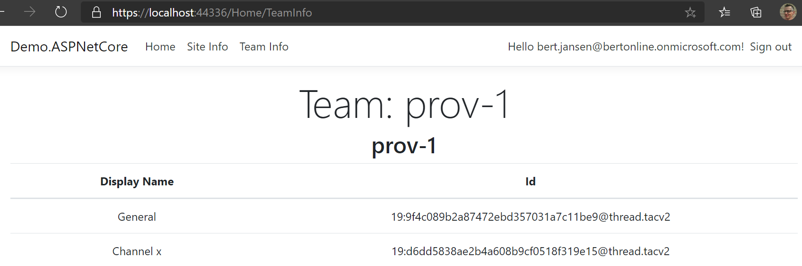

# PnP Core SDK - ASP.NET Core Sample

This solution demonstrates how the PnP Core SDK can be used in a ASP.NET Core web application

## Source code

You can find the sample source code here: [/samples/Demo.ASPNetCore](https://github.com/pnp/pnpcore/tree/dev/samples/Demo.ASPNetCore)

## Prerequisites

- .NET 10.0 SDK or higher installed. You can download it from https://dotnet.microsoft.com/download

### Additional prerequisites for Visual Studio Code

In order to run and debug this sample in Visual Studio Code you need to install the following extensions:

- [C# Dev Kit](https://marketplace.visualstudio.com/items?itemName=ms-dotnettools.csdevkit)
- [C#](https://marketplace.visualstudio.com/items?itemName=ms-dotnettools.csharp)

### Step 1) Create an Azure AD application

The one thing to configure before you can use this sample is an Azure AD application:

1. Navigate to https://entra.microsoft.com/
2. Click on **Entra ID**, followed by navigating to **App registrations**
3. Add a new application via the **New registration** link
4. Give your application a name, e.g. PnPCoreSDKASPNetCoreDemo, make sure *Accounts in this organizational directory only* is selected and for Web platform add **https://localhost:44336/signin-oidc** (The port may vary according to dev environment) as redirect URI. Clicking on **Register** will create the application and open it
5. Take note of the **Application (client) ID** value, you'll need it in the next step
6. Click on **API permissions** and add these **delegated** permissions
   1. Microsoft Graph  
        1. Directory.Read.All
        2. User.Read
        3. Sites.Read.All
        4. Files.Read.All
   2. SharePoint
        1. AllSites.Read
7. Consent the application permissions by clicking on **Grant admin consent**
8. From **Overview**,
    1. copy the value of **Directory (tenant) ID**
    2. copy the value of **Application (client) ID**

## Configure your application

- Configure the name of your tenant as the value of `AzureAd:Domain` in appsettings.json setting
- Configure the Tenant ID of your app as the value of `AzureAd:TenantId` in appsettings.json setting
- Configure the Client ID of your app as the value of `AzureAd:ClientId` in appsettings.json setting
- Configure the Client Secret of your app as the value of `AzureAd:ClientSecret` in appsettings.json setting
- Configure the URL of the target "modern" team site as the value of `PnPCore:Sites:DemoSite:SiteUrl` in appsettings.json setting

Using an environment specific appsettings.`{ASPNETCORE_ENVIRONMENT}`.json file is supported also.
The `ASPNETCORE_ENVIRONMENT` default value for debugging is set to `Development`, so you can create an `wwwroot/appsettings.Development.json` file and add your configuration there.
For more details about runtime environments see: [ASP.NET Core runtime environments](https://learn.microsoft.com/en-us/aspnet/core/fundamentals/environments)

Be sure to have a Team in Microsoft Teams backing the modern team site in the above site collection

## Step 3) Run the sample

### Visual Studio Code and Visual Studio

Press **F5** to launch the sample. 

### Terminal

First you will need to build the project by running `dotnet build` in the project folder. 

Once the build is successful you can run the sample by executing `dotnet run` in the same folder. 
Use `dotnet run --environment ASPNETCORE_ENVIRONMENT={EnvironmentName}` to specify the desired environment.
Default environment is `Production`. The default environment will be overwritten by launchSettings.json file if present. If there is no appsettings file for the specified environment, the setttings from appsettings.json will not be overwritten and will be used.
For more details about runtime environments see: [ASP.NET Core runtime environments](https://learn.microsoft.com/en-us/aspnet/core/fundamentals/environments)

When trying to access one of the sections, the applications prompts you for signing in.

