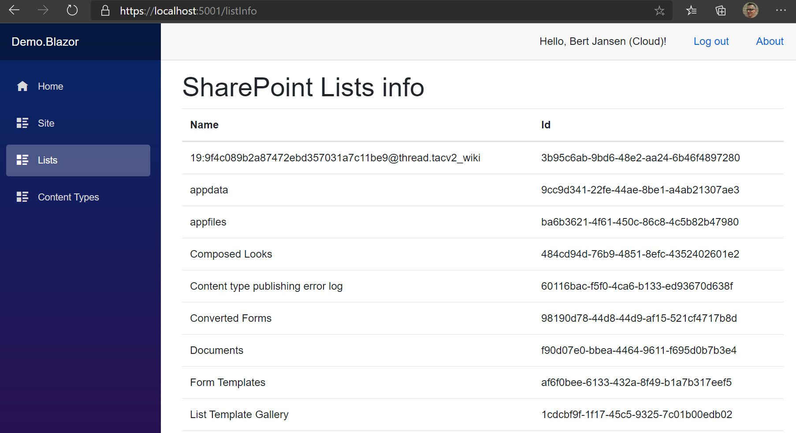

# PnP Core SDK - Blazor Sample

This solution demonstrates how the PnP Core SDK can be used in a Blazor WebAssembly app

## Source code

You can find the sample source code here: [/samples/Demo.Blazor](https://github.com/pnp/pnpcore/tree/dev/samples/Demo.Blazor)

## Prerequisites

- .NET 10.0 SDK or higher installed. You can download it from https://dotnet.microsoft.com/download

### Additional prerequisites for Visual Studio Code

In order to run and debug this sample in Visual Studio Code you need to install the following extensions:

- [C# Dev Kit](https://marketplace.visualstudio.com/items?itemName=ms-dotnettools.csdevkit)
- [C#](https://marketplace.visualstudio.com/items?itemName=ms-dotnettools.csharp)

### Step 1) Create an Azure AD application

The one thing to configure before you can use this sample is an Azure AD application:

1. Navigate to https://entra.microsoft.com/
2. Click on **Entra ID**, followed by navigating to **App registrations**
3. Add a new application via the **New registration** link
4. Give your application a name, e.g. PnPCoreSDKBlazorWasmDemo, make sure *Accounts in this organizational directory only* is selected and click on **Register**
5. Open the **Authentication** page, click on **Add a platform** and pick **Single-page application**. Add **https://localhost:5001/authentication/login-callback** (the port may vary according to your dev environment) as redirect URI and click **Configure**
    > Blazor WebAssembly signs in from the browser using the authorization code flow with PKCE, which is only allowed for the *Single-page application* platform. Registering the redirect URI under the **Web** platform results in the error *AADSTS9002326: Cross-origin token redemption is permitted only for the 'Single-Page Application' client-type*.
6. Take note of the **Application (client) ID** value, you'll need it in the next step
7. Click on **API permissions** and add these **delegated** permissions
   1. Microsoft Graph  
        1. email
        2. openid
        3. Sites.FullControl.All
   2. SharePoint
        1. AllSites.FullControl
8. Consent the application permissions by clicking on **Grant admin consent**
9. From **Overview**,
    1. copy the value of **Directory (tenant) ID**
    2. copy the value of **Application (client) ID**

### Step 2) Configure the application

appsettings (`wwwroot/appsettings.json`)
- Replace Client ID as the value of `{client_id}` in appsettings
- Replace Tenant ID as the value of `{tenant_id}` in appsettings
- Replace URL of your SharePoint site as the value of `{sharepoint_url}` in appsettings

Using an environment specific appsettings.`{ASPNETCORE_ENVIRONMENT}`.json file is supported also.
The `ASPNETCORE_ENVIRONMENT` default value for debugging is set to `Development`, so you can create an `wwwroot/appsettings.Development.json` file and add your configuration there.
For more details about runtime environments see: [ASP.NET Core runtime environments](https://learn.microsoft.com/en-us/aspnet/core/fundamentals/environments)

## Step 3) Run the sample

### Visual Studio Code and Visual Studio

Press **F5** to launch the sample. 

### Terminal

First you will need to build the project by running `dotnet build` in the project folder. 
Ensure the ASP.NET Core developer certificate is trusted. If you see the following message, you will need to trust the certificate before running the sample.

Message

`The ASP.NET Core developer certificate is not trusted. For information about trusting the ASP.NET Core developer certificate, see https://aka.ms/aspnet/https-trust-dev-cert`

CLI 

`dotnet dev-certs https --trust`

Once the build is successful you can run the sample by executing `dotnet run` in the same folder. 
Use `dotnet run --environment ASPNETCORE_ENVIRONMENT=<EnvironmentName>` to specify the desired environment.
Default environment is `Production`. The default environment will be overwritten by launchSettings.json file if present. If there is no appsettings file for the specified environment, the setttings from appsettings.json will not be overwritten and will be used.
For more details about runtime environments see: [ASP.NET Core runtime environments](https://learn.microsoft.com/en-us/aspnet/core/fundamentals/environments)

When trying to access one of the sections, the applications prompts you for signing in

