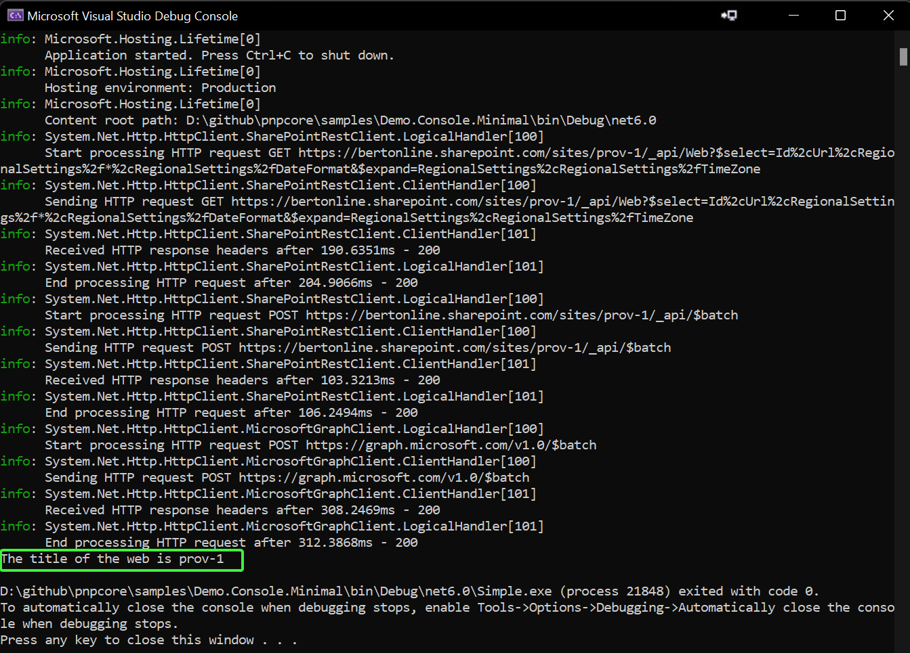

# PnP Core SDK - Minimal getting started sample

This solution aims at showing you how you can use PnP Core SDK using the minimal amount of configuration and code.

## Source code

You can find the sample source code here: [/samples/Demo.Console.Minimal](https://github.com/pnp/pnpcore/tree/dev/samples/Demo.Console.Minimal)

## Prerequisites

- .NET 10.0 SDK or higher installed. You can download it from https://dotnet.microsoft.com/download

### Additional prerequisites for Visual Studio Code

In order to run and debug this sample in Visual Studio Code you need to install the following extensions:

- [C# Dev Kit](https://marketplace.visualstudio.com/items?itemName=ms-dotnettools.csdevkit)
- [C#](https://marketplace.visualstudio.com/items?itemName=ms-dotnettools.csharp)

## Sample configuration

### Step 1) Create an Azure AD application

The one thing to configure before you can use this sample is an Azure AD application:

1. Navigate to https://entra.microsoft.com/
2. Click on **Entra ID**, followed by navigating to **App registrations**
3. Add a new application via the **New registration** link
4. Give your application a name, e.g. PnPCoreSDKConsoleDemo and add **http://localhost** as redirect URI. Clicking on **Register** will create the application and open it
5. Take note of the **Application (client) ID** value, you'll need it in the next step
6. Click on **API permissions** and add these **delegated** permissions
   1. Microsoft Graph -> Sites.Manage.All
   2. SharePoint -> AllSites.Manage
7. Consent the application permissions by clicking on **Grant admin consent**

### Step 2) Configure the application

Open **Program.cs** and update the value assigned to the `clientId`, `tenantId`, and `siteUrl` variables to the created Entra Id client id, tenant id, and valid site URL for your tenant.

## Step 3) Run the sample

### Visual Studio Code and Visual Studio

Press **F5** to launch the sample. A new browser window/tab will open asking you to authenticate with your Microsoft 365 account. Once you've done that the application will get the title of the site and display it.

### Terminal

First you will need to build the project by running `dotnet build` in the project folder. Once the build is successful you can run the sample by executing `dotnet run` in the same folder. A new browser window/tab will open asking you to authenticate with your Microsoft 365 account. Once you've done that the application will get the title of the site and display it.

## Example output

