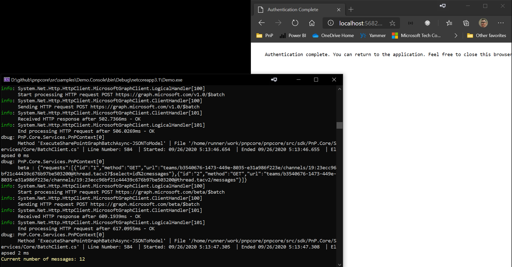

# PnP Core SDK - Console Sample

This solution demonstrates how the PnP Core SDK can be used in a console application. In this sample we're querying a modern group connected SharePoint site which also has Teams. If you're testing this code against a modern communication site or another classic site then please comment out the "teams" parts.

## Source code

You can find the sample source code here: [/samples/Demo.Console](https://github.com/pnp/pnpcore/tree/dev/samples/Demo.Console)

## Prerequisites

- .NET 10.0 SDK or higher installed. You can download it from https://dotnet.microsoft.com/download

### Additional prerequisites for Visual Studio Code

In order to run and debug this sample in Visual Studio Code you need to install the following extensions:

- [C# Dev Kit](https://marketplace.visualstudio.com/items?itemName=ms-dotnettools.csdevkit)
- [C#](https://marketplace.visualstudio.com/items?itemName=ms-dotnettools.csharp)

## Sample configuration

### Step 1) Create an Azure AD application

The one thing to configure before you can use this sample is an Azure AD application:

1. Navigate to https://entra.microsoft.com/
2. Click on **Entra ID**, followed by navigating to **App registrations**
3. Add a new application via the **New registration** link
4. Give your application a name, e.g. PnPCoreSDKConsoleAppDemo, make sure *Accounts in this organizational directory only* is selected and add **http://localhost** as redirect URI (only needed if you want use an interactive authentication flow). Clicking on **Register** will create the application and open it
5. Take note of the **Application (client) ID** value, you'll need it in the next step
6. Click on **API permissions** and add these **delegated** permissions
   1. Microsoft Graph -> Directory.Read.All
   2. Microsoft Graph -> User.Read
   3. Microsoft Graph -> ChannelMessage.Read.All
   4. Microsoft Graph -> ChannelMessage.Send
   5. Microsoft Graph -> TeamSettings.ReadWrite.All
   6. Microsoft Graph -> TeamsTab.ReadWrite.All
   7. Microsoft Graph -> Sites.Manage.All
   8. SharePoint -> AllSites.Manage
7. Consent the application permissions by clicking on **Grant admin consent**
8. From **Overview**,
    1. copy the value of **Directory (tenant) ID**
    2. copy the value of **Application (client) ID**

### Step 2) Configure the application
- This demo application comes with code for 2 different authentication providers, the `CredentialManagerAuthenticationProvider` or the `InteractiveAuthenticationProvider` can be used. The latter is the default value. To configure the app update the `appsettings.json` file with:

- Configure the Tenant ID of your app as the value of `CustomSettings:TenantId` in appsettings.json setting
- Configure the Client ID of your app as the value of `CustomSettings:ClientId` in appsettings.json setting
- Configure the URL of a target Microsoft SharePoint Online modern team site collection as the value of `CustomSettings:DemoSiteUrl` in appsettings.json setting
- Configure the URL of a target Microsoft SharePoint Online sub site as the value of `CustomSettings:DemoSubSiteUrl` in appsettings.json setting

Using an environment specific appsettings.`DOTNET_ENVIRONMENT`.json file is supported also.
The `DOTNET_ENVIRONMENT` default value for debugging is set to `Development`, so you can create an appsettings.Development.json file and add your configuration there.
To set a different environment for debugging you can use the env.txt file in the root of the project. 
You can use env.sample and appsettings.copyme.json as templates for env.txt and appsettings.`DOTNET_ENVIRONMENT`.json respectively and replace the placeholders (`ClientId`, `TenantId`, `TenantName`, `CredentialManagerName`).

Be sure to have a Team in Microsoft Teams backing the modern team site in the above site collection

## Step 3) Run the sample
### Visual Studio Code and Visual Studio
Press **F5** to launch the sample. 

When clicking on one of the buttons a new browser window/tab will open asking you to authenticate with your Microsoft 365 account. 
Depending on the button you clicked, the application will execute the action and displays the results.

### Terminal

First you will need to build the project by running `dotnet build` in the project folder. Once the build is successful you can run the sample by executing `dotnet run` in the same folder. 
Use `dotnet run --environment DOTNET_ENVIRONMENT=<EnvironmentName>` to specify the desired environment.
Default environment is `Production`. The default environment will be overwritten by launchSettings.json file if present. If there is no appsettings file for the specified environment, the setttings from appsettings.json will not be overwritten and will be used.
When clicking on one of the buttons a new browser window/tab will open asking you to authenticate with your Microsoft 365 account.

