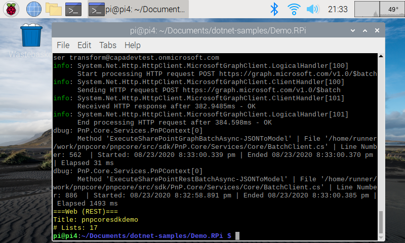

# Introduction

This sample demonstrates using the pnp core library running on a Raspberry Pi device.

## Setup

### Hardware

The hardware used:

- Raspberry Pi 4 (4 GB edition)
- HyperPixel 4-inch screen (optional)

Note: this does not imply any limitations or minimal specifications for the apps to run on these 
types of devices, just a description of the hard used for the project.

### Software

The operating system installed on the Raspberry Pi device is: "Raspbian GNU/Linux 10 (buster)"

Before, ASP.NET core application can execute, you must install the ASP.NET Core 3.1 Runtime and SDK.
[https://dotnet.microsoft.com/download/dotnet-core/3.1](https://dotnet.microsoft.com/download/dotnet-core/3.1)
specifically the ARM-32 bit edition.

## Running the app

In this folder is a demo application that connects to SharePoint grabs,
the site title and a count of the number of lists using the Username/Password authentication.

To get running:

- Either download this to the Raspberry Pi device directly or FTP the files over from a desktop PC.
- Rename the **appsettings.officedevpnp.sample** file to **appsettings.officedevpnp.json**
- Update **appsettings.officedevpnp.json** with the connection details to a demo SharePoint site
- Run in Terminal **dotnet build**
- Run in Terminal **dotnet run**

This will then output to the console the communications to SharePoint and the resulting details of the site.